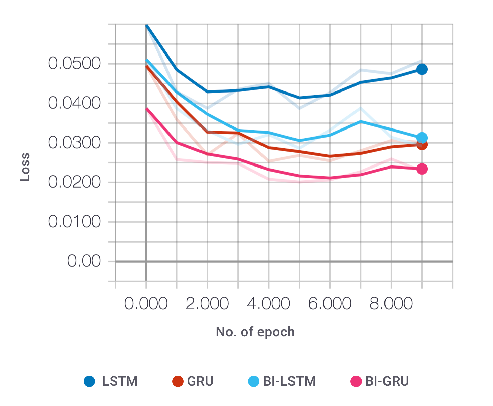
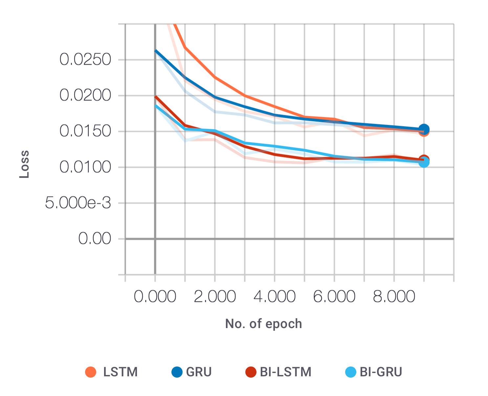

# Named Entitiy Recognition

Contributors:
- Luka Bašek - https://github.com/lbasek
- Luka Dulčić - https://github.com/ldulcic

Named entity recognition or entity extraction refers to a data extraction task that is responsible for finding and classification words of sentence into predetermined categories such as the names of persons, organizations, locations, expressions of times, etc.

### Example:

> ”Android Inc. was founded in Palo Alto, California, in October 2003 by Andy Rubin, Rich Miner, Nick Sears, and Chris White.” 

> ”**ORG**(Android Inc.) **O**(was founded in) **LOC**(Palo Alto), **LOC**(California), **O**(in) **TIME**(October 2003) **O**(by) **PER**(Andy Rubin), **PER**(Rich Miner), **PER**(Nick Sears), **O**(and) **PER**(Chris White).“ 

In the project, we used the Python programming language and the Keras library. We tested different architectures of recurrent neural networks that use *LSTM* and *GRU* memory cells. We also performed various experiments in which we searched for the optimal parameters of the neural network with the intent to accurately recognize and classify name entities. 

Dataset: `CoNLL2003`

Labels:   `B-PER, I-PER, B-LOC, I-LOC, B-MISC, I-MISC, B-ORG, I-ORG, O`

Used libraries: `keras, spacy, numpy, scikit-learn, matplotlib`

## Model accuracy and loss without additional features
  

## Model accuracy and loss with additional features
  

